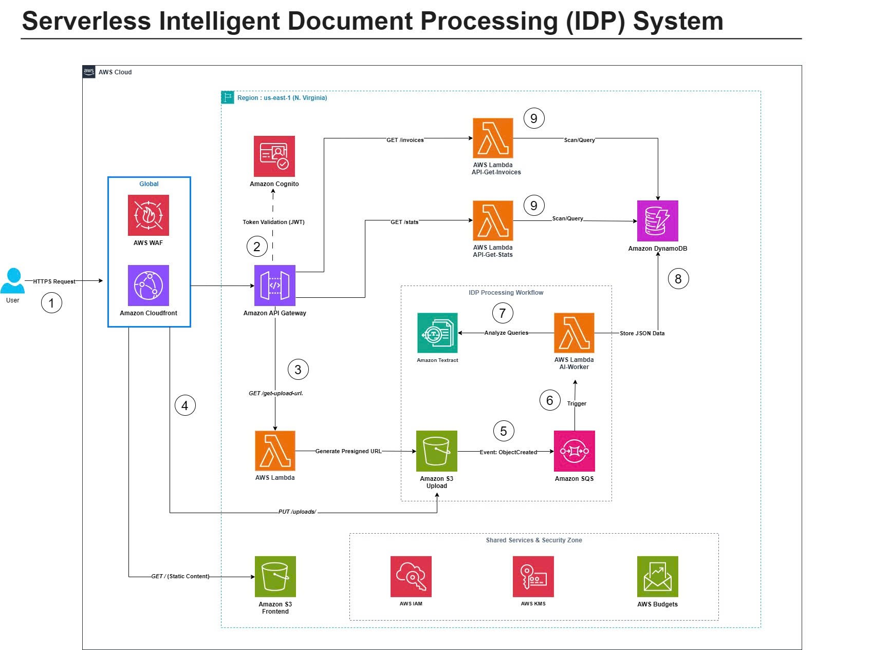

### Mục tiêu tuần 10:

- Chỉnh sửa và hoàn thiện sơ đồ kiến trúc chính thức cho dự án Serverless Intelligent Document Processing (IDP) dựa trên các góp ý từ anh chị Admin trong group First Cloud Journey.
- Nghiên cứu chuyên sâu các dịch vụ Serverless cốt lõi trong dự án: Amazon API Gateway, AWS Lambda, Amazon S3, Amazon SQS, Amazon Textract, Amazon DynamoDB và Amazon Cognito.
- Bắt đầu triển khai các thành phần hạ tầng nền tảng đầu tiên trên môi trường AWS thực tế (Region us-east-1).

### Các công việc cần triển khai trong tuần này:

| Thứ | Công việc                                                                                                                                                                                                                                                                     | Ngày bắt đầu | Ngày hoàn thành | Nguồn tài liệu                            |
| --- | ----------------------------------------------------------------------------------------------------------------------------------------------------------------------------------------------------------------------------------------------------------------------------- | ------------ | --------------- | ----------------------------------------- |
| 2   | - Tổng hợp và phân tích các góp ý từ anh chị Admin về sơ đồ kiến trúc v1 của hệ thống IDP   - Chỉnh sửa sơ đồ: tối ưu luồng xử lý tài liệu (S3 → SQS → Lambda AI-Worker → Textract → DynamoDB), cải thiện phân vùng bảo mật (Shared Services & Security Zone)           | 22/06/2026   | 22/06/2026      | Góp ý từ anh chị Admin FCJ                |
| 3   | - Hoàn thiện sơ đồ kiến trúc chính thức (phiên bản final) với đầy đủ 9 bước xử lý   - Xác định thứ tự triển khai các thành phần: IAM/KMS trước → S3 Buckets → DynamoDB → Lambda Functions → API Gateway → Cognito → WAF                                                  | 23/06/2026   | 23/06/2026      | draw.io, AWS Well-Architected Framework   |
| 4   | - Nghiên cứu chi tiết tài liệu kỹ thuật: Amazon API Gateway (REST API), AWS Lambda (Execution Role, Timeout, Memory), Amazon S3 (Presigned URL, Event Notification)   - Tìm hiểu Amazon SQS (Standard Queue, Trigger Lambda), Amazon Textract (AnalyzeDocument, Queries)  | 24/06/2026   | 24/06/2026      | AWS Documentation, Khóa học FCJ           |
| 5   | - Triển khai tầng Shared Services & Security Zone: tạo IAM Role cho từng Lambda Function, cấu hình AWS KMS cho mã hóa dữ liệu, thiết lập AWS Budgets theo dõi chi phí   - Khởi tạo 2 S3 Bucket: S3 Upload (lưu tài liệu) và S3 Frontend (hosting trang tĩnh)              | 25/06/2026   | 25/06/2026      | AWS Console, Khóa học FCJ                 |
| 6   | - Tạo bảng Amazon DynamoDB để lưu trữ dữ liệu JSON đã xử lý   - Triển khai Lambda Function đầu tiên: hàm tạo Presigned URL cho phép người dùng upload tài liệu trực tiếp lên S3 Upload   - Cấu hình S3 Event Notification (ObjectCreated) gửi sự kiện vào Amazon SQS  | 26/06/2026   | 26/06/2026      | AWS Console, AWS Documentation            |
| 7   | - Kiểm tra luồng upload cơ bản: Lambda tạo Presigned URL → Client upload file lên S3 → S3 Event kích hoạt SQS   - Ghi nhận các vấn đề phát sinh về IAM Policy, S3 CORS hoặc SQS Permission, lập danh sách các bước cần triển khai tiếp ở tuần sau                         | 27/06/2026   | 27/06/2026      | <https://cloudjourney.awsstudygroup.com/> |

### Kết quả đạt được tuần 10:

| Thứ | Công việc                                               | Kết quả đạt được                                                                                                                                                                                                                                              |
| --- | ------------------------------------------------------- | ------------------------------------------------------------------------------------------------------------------------------------------------------------------------------------------------------------------------------------------------------------- |
| 2   | Phân tích góp ý và chỉnh sửa sơ đồ kiến trúc            | Tổng hợp đầy đủ các góp ý từ anh chị Admin, tối ưu luồng xử lý tài liệu qua pipeline S3 → SQS → Lambda AI-Worker → Textract → DynamoDB và cải thiện phân vùng Shared Services & Security Zone (IAM, KMS, Budgets).                                           |
| 3   | Hoàn thiện sơ đồ kiến trúc chính thức (final)            | Hoàn thành phiên bản chính thức sơ đồ kiến trúc hệ thống IDP với đầy đủ 9 bước xử lý. Xác định được thứ tự triển khai hợp lý: IAM/KMS → S3 → DynamoDB → Lambda → API Gateway → Cognito → WAF.                                                                |
| 4   | Nghiên cứu tài liệu kỹ thuật các dịch vụ Serverless     | Nắm vững cấu hình API Gateway REST API, Lambda Execution Role, S3 Presigned URL và Event Notification, SQS Standard Queue trigger Lambda, Textract AnalyzeDocument API. Ước tính được mức phí dự kiến để tối ưu ngân sách.                                      |
| 5   | Triển khai Shared Services, S3 Buckets                   | Thiết lập thành công IAM Role riêng biệt cho từng Lambda Function theo nguyên tắc Least Privilege, cấu hình KMS key mã hóa dữ liệu, thiết lập Budgets. Khởi tạo 2 S3 Bucket: Upload (lưu tài liệu gốc) và Frontend (hosting trang tĩnh).                      |
| 6   | Triển khai DynamoDB, Lambda Presigned URL, SQS           | Tạo thành công bảng DynamoDB lưu dữ liệu JSON. Triển khai Lambda Function tạo Presigned URL cho upload tài liệu. Cấu hình S3 Event Notification (ObjectCreated) kích hoạt thông báo vào hàng đợi Amazon SQS.                                                   |
| 7   | Kiểm tra luồng upload và ghi nhận vấn đề phát sinh       | Xác nhận luồng upload cơ bản hoạt động: Lambda tạo Presigned URL → Client upload file thành công lên S3 → S3 Event gửi thông báo vào SQS. Ghi nhận và xử lý các vấn đề IAM Policy, S3 CORS. Lập kế hoạch triển khai tiếp tầng AI Processing ở tuần sau.        |

---

### Hình ảnh minh chứng thực tế:

