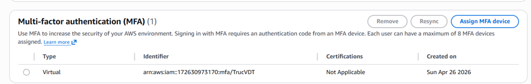
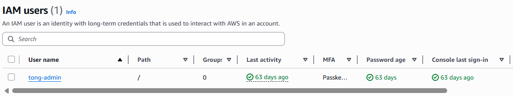
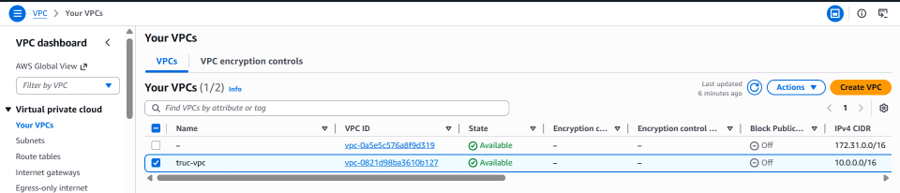
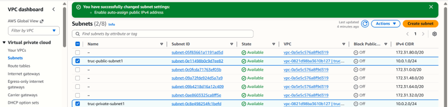

### Mục tiêu tuần 2:

- Củng cố kiến thức bảo mật tài khoản, quản lý người dùng nâng cao trên hệ thống IAM.
- Nghiên cứu lý thuyết và cấu hình thực tế kiến trúc mạng ảo Amazon VPC.
- Thực hành phân chia subnet, cấu hình định tuyến và thiết lập các nhóm bảo mật (Security Groups) để bảo vệ hạ tầng tài nguyên.

### Các công việc cần triển khai trong tuần này:

| Thứ | Công việc                                                                                                                                                                                                 | Ngày bắt đầu | Ngày hoàn thành | Nguồn tài liệu                            |
| --- | --------------------------------------------------------------------------------------------------------------------------------------------------------------------------------------------------------- | ------------ | --------------- | ----------------------------------------- |
| 2   | - Nghiên cứu sâu về quản lý bảo mật và người dùng trên hệ thống   - Tìm hiểu cách thiết lập cấu hình bảo mật 2 lớp (MFA) cho tài khoản                                                                 | 24/04/2026   | 24/04/2026      | Khóa học First Cloud AI Journey           |
| 3   | - Thực hành phân quyền trên IAM, quản lý nhóm và phân tách quyền hạn giữa Root User và IAM User   - Tạo tài khoản phụ phục vụ cho các thao tác làm việc hằng ngày                                      | 25/04/2026   | 25/04/2026      | Khóa học First Cloud AI Journey           |
| 4   | - Học lý thuyết Module 02 về Amazon Virtual Private Cloud (VPC)   - Tìm hiểu các khái niệm cốt lõi: vpc là gì, subnet công khai (public) và riêng tư (private)                                         | 27/04/2026   | 27/04/2026      | Khóa học First Cloud AI Journey           |
| 5   | - Tìm hiểu cơ chế định tuyến qua bảng định tuyến (Route Table) và cổng Internet (Internet Gateway)   - Nghiên cứu giải pháp cổng NAT (NAT Gateway) giúp các máy chủ private kết nối internet một chiều | 28/04/2026   | 28/04/2026      | <https://cloudjourney.awsstudygroup.com/> |
| 6   | - Thiết kế sơ đồ mạng cho bài Lab thực hành   - Chuẩn bị các dải địa chỉ IP CIDR cho VPC và các subnet dự kiến khởi tạo                                                                                | 29/04/2026   | 29/04/2026      | Khóa học First Cloud AI Journey           |
| 7   | - Tiến hành làm bài Lab thực tế trên AWS Console   - Khởi tạo VPC, chia public/private subnet, cấu hình Internet Gateway, Route Table và thiết lập các quy tắc tường lửa với Security Groups           | 30/04/2026   | 30/04/2026      | <https://cloudjourney.awsstudygroup.com/> |

### Kết quả đạt được tuần 2:

| Thứ | Công việc                                | Kết quả đạt được                                                                                                                                                                                                                                                                         |
| --- | ---------------------------------------- | ---------------------------------------------------------------------------------------------------------------------------------------------------------------------------------------------------------------------------------------------------------------------------------------- |
| 2   | Cấu hình bảo mật 2 lớp (MFA)             | Thiết lập thành công xác thực đa yếu tố (MFA) cho môi trường tài khoản, tăng cường lá chắn bảo mật hệ thống.                                                                                                                                                                             |
| 3   | Phân quyền và quản lý tài khoản IAM      | Đảm bảo an toàn cho Root User bằng cách tắt các active access key. Thực hiện quản lý, phân quyền cho người dùng phụ truc-user thuộc nhóm Admin-groups để làm việc hằng ngày đúng quy định.                                                                                               |
| 4   | Nghiên cứu lý thuyết Amazon VPC          | Hiểu rõ bản chất cô lập logic của mạng ảo VPC nhằm phân tách các môi trường phát triển (dev, test, production). Nắm chắc cách chia nhỏ không gian mạng thành các public subnet và private subnet.                                                                                        |
| 5   | Tìm hiểu cơ chế định tuyến mạng          | Nắm vững cách thức hoạt động của Default route table và Custom route table. Hiểu cách sử dụng Internet Gateway để mở luồng ra internet và cách NAT Gateway kết nối an toàn một chiều cho các dịch vụ bên trong mạng private.                                                             |
| 6   | Chuẩn bị hạ tầng phân định tài nguyên    | Xác định rõ các thông số kỹ thuật, dải IP CIDR 10.0.0.0/16 và lên kế hoạch liên kết rõ ràng cho các thành phần mạng trước khi triển khai thực tế trên console.                                                                                                                           |
| 7   | Thực hành Lab 03 triển khai hệ thống VPC | Khởi tạo thành công mạng ảo với tên truc-vpc (IP CIDR 10.0.0.0/16). Cấu hình chi tiết truc-public-subnet1 và truc-private-subnet1. Đính kèm cổng truc-igw, tạo bảng định tuyến truc-route-Public1 và thiết lập hai nhóm bảo mật cho phép quản trị các giao thức SSH, Ping, HTTP an toàn. |

---

### Hình ảnh minh chứng thực tế:

**Thứ 2: Cấu hình bảo mật 2 lớp (MFA)**

**Thứ 3: Phân quyền và quản lý tài khoản IAM**

**Thứ 4: Nghiên cứu lý thuyết Amazon VPC**

**Thứ 5: Tìm hiểu cơ chế định tuyến mạng**

**Thứ 6: Chuẩn bị hạ tầng phân định tài nguyên**

**Thứ 7: Thực hành Lab 03 triển khai hệ thống VPC**

