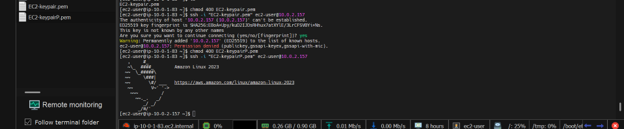
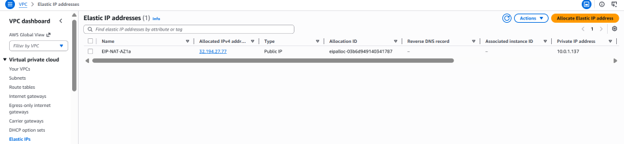
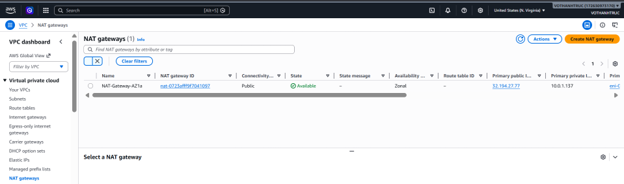
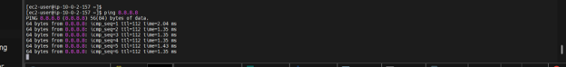
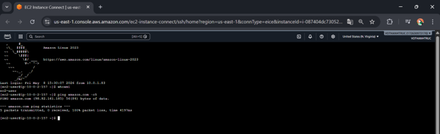

### Week 3 Objectives:

- Establish outbound internet connectivity for instances located within the private subnet and deploy advanced secure connection methods.
- Learn how to manage core network infrastructure without exposing it or opening inbound traffic to the public internet.
- Develop a structured mindset regarding cloud cost optimization and proper resource decommissioning workflows on AWS.

### Tasks to Deploy This Week:

| Day | Task                                                                                                                                                                                                                                          | Start Date | Completion Date | Documentation Source                      |
| --- | --------------------------------------------------------------------------------------------------------------------------------------------------------------------------------------------------------------------------------------------- | ---------- | --------------- | ----------------------------------------- |
| Mon | - Research deployment mechanisms and outbound internet route allocation for private networks via a NAT Gateway   - Learn how to allocate static Elastic IP addresses for network gateways                                                  | 01/05/2026 | 01/05/2026      | First Cloud AI Journey Course             |
| Tue | - Study advanced secure connection methods using the EC2 Instance Connect Endpoint (EICE) tool   - Explore how to SSH directly into private instances without using a Bastion Host or public IP                                            | 02/05/2026 | 02/05/2026      | First Cloud AI Journey Course             |
| Wed | - Analyze Security Group configurations designed for network isolation   - Study nested security groups and troubleshooting connectivity issues by properly configuring Outbound Rules                                                     | 04/05/2026 | 04/05/2026      | First Cloud AI Journey Course             |
| Thu | - Read documentation guides regarding cost optimization and efficient budget management on AWS   - Inspect the hourly pricing models of background resources such as NAT Gateways or unassociated Elastic IPs                              | 05/05/2026 | 05/05/2026      | <https://cloudjourney.awsstudygroup.com/> |
| Fri | - Plan detailed implementation steps for the network topology, including setting up the NAT Gateway, creating the EICE, and preparing test commands   - Draft a resource decommissioning checklist to avoid unintended penalty charges     | 06/05/2026 | 06/05/2026      | First Cloud AI Journey Course             |
| Sat | - Execute live configuration steps directly on the AWS Management Console   - Configure routing tables, run ping/curl commands from the private instance to verify network paths, troubleshoot errors, and perform a full resource cleanup | 07/05/2026 | 07/05/2026      | <https://cloudjourney.awsstudygroup.com/> |

### Week 3 Achievements:

| Day | Task                                                   | Achievement                                                                                                                                                                                                                                                                                           |
| --- | ------------------------------------------------------ | ----------------------------------------------------------------------------------------------------------------------------------------------------------------------------------------------------------------------------------------------------------------------------------------------------- |
| Mon | NAT gateway connectivity planning                      | Mastered the theoretical process of deploying a NAT Gateway inside a public subnet, successfully allocating a static Elastic IP, and routing outbound traffic from a private network safely.                                                                                                          |
| Tue | Secure connection method research                      | Gained expertise in setting up an EC2 Instance Connect Endpoint (EICE) within a VPC to manage private instance terminal sessions securely via the web console.                                                                                                                                        |
| Wed | Firewall rules analysis & troubleshooting              | Acquired a deep understanding of setting up nested security groups and learned how to resolve SSH connection timeouts by precisely establishing required Inbound/Outbound Rules.                                                                                                                      |
| Thu | Cloud cost optimization studies                        | Developed a clear accountability for cloud resources by calculating specific consumption expenses, such as the idle idle fee of $0.045 per hour for a running NAT Gateway.                                                                                                                            |
| Fri | Lab script & cleanup workflow preparation              | Finalized the operational blueprint, detailing network verification syntax (such as ping and curl commands) alongside step-by-step infrastructure disposal sequences.                                                                                                                                 |
| Sat | Hands-on lab implementation & resource decommissioning | Confirmed successful outbound internet access from the private instance through the NAT Gateway. Accessed the EC2-Private terminal directly and applied cost optimization by cleanly deleting the NAT Gateway, releasing the Elastic IP, terminating test instances, and tearing down the custom VPC. |

---

### Practical Evidence Images:

#### 1. Establishing an SSH connection to the public server (EC2-Public) via MobaXterm

Successfully connected to the public server instance at IP `34.239.227.34` running Amazon Linux 2023 using the MobaXterm client SSH session.

#### 2. Checking Internet connectivity and executing API calls from the Public instance

Executed a successful `ping` command to test public wide-area network routing to Google and leveraged `curl -I` to verify valid HTTP header responses from Amazon.

#### 3. Configuring key pair permissions and performing a multi-hop SSH connection from Public to Private

Configured secure access permissions for the private key file (`chmod 400`) and initiated a protected internal SSH connection from the public subnet space into the private server instance (`10.0.2.157`).

#### 4. Allocating a static public IP (Elastic IP) for the NAT Gateway infrastructure

The VPC management dashboard indicates successful allocation of a dedicated static Elastic IP `32.194.27.77` designated as `EIP-NAT-AZ1a` to back the gateway network routing.

#### 5. Launching the NAT Gateway resource within the AWS Management Console

The networking engine records that the `NAT-Gateway-AZ1a` service has been properly mapped to the newly provisioned static Elastic IP and has fully transitioned into the active `Available` state.

#### 6. Verifying one-way outbound network communication from the isolated Private server

Following proper route table updates through the NAT Gateway, the isolated `EC2-Private` host successfully executed a `ping 8.8.8.8` request, receiving complete external data packets.

#### 7. Direct terminal administration utilizing the EC2 Instance Connect Endpoint (EICE) service

Established an authenticated secure console session straight into the private environment terminal from a standard web browser interface via the designated endpoint attachment.

