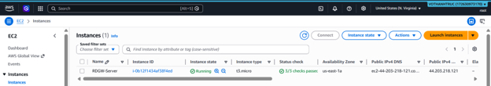
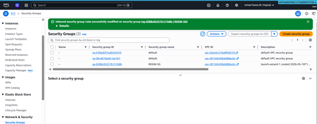
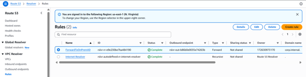
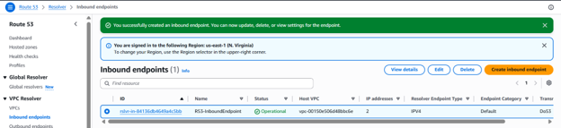
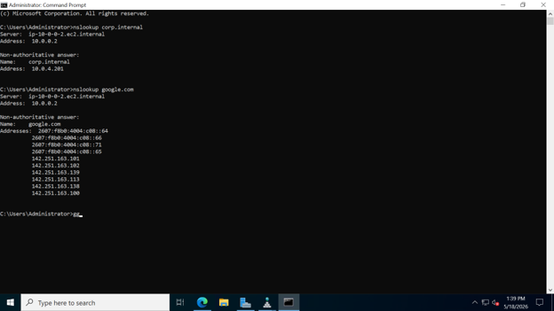

### Week 4 Objectives:

- Optimize connectivity and domain name resolution in complex network infrastructure models.
- Establish a Hybrid DNS solution using Route 53 Resolver to synchronize AWS and On-Premises environments.
- Initialize VPC Peering connections to allow virtual networks to communicate internally and securely without traversing the public internet.
- Apply Zero Trust security principles and strict resource management to optimize the budget.

### Tasks to Deploy This Week:

| Day | Task                                                                                                                                                                                                   | Start Date | Completion Date | Documentation Source                      |
| --- | ------------------------------------------------------------------------------------------------------------------------------------------------------------------------------------------------------ | ---------- | --------------- | ----------------------------------------- |
| Mon | - Research the Hybrid DNS resolution mechanism between cloud and traditional environments   - Learn about the Route 53 Resolver service and how to create Inbound/Outbound endpoints                | 11/05/2026 | 11/05/2026      | First Cloud AI Journey Course             |
| Tue | - Practice Lab 10: Use CloudFormation to provision infrastructure and deploy AWS Managed Microsoft AD to simulate On-Premises DNS   - Configure Resolver Rules and verify resolution using nslookup | 12/05/2026 | 12/05/2026      | First Cloud AI Journey Course             |
| Wed | - Learn the theory of Lab 19 regarding VPC Peering connections   - Plan the allocation of two non-overlapping IP CIDR blocks for My VPC and HG VPC in preparation for peering                       | 13/05/2026 | 13/05/2026      | First Cloud AI Journey Course             |
| Thu | - Update Network ACLs to restrict access at the subnet level   - Practice initiating a Peering Connection request and accepting the connection between the two VPCs                                 | 14/05/2026 | 14/05/2026      | First Cloud AI Journey Course             |
| Fri | - Configure Route Tables to direct traffic through the Peering Connection   - Enable Cross-Peer DNS to resolve to Private IP addresses between instances                                            | 15/05/2026 | 15/05/2026      | First Cloud AI Journey Course             |
| Sat | - Set up Inbound rules for Security Groups and apply IAM Policies to limit the practice region based on the Zero Trust model   - Clean up all resources to avoid unexpected charges                 | 16/05/2026 | 16/05/2026      | <https://cloudjourney.awsstudygroup.com/> |

### Week 4 Achievements:

| Day | Task                                        | Achievement                                                                                                                                                                                                |
| --- | ------------------------------------------- | ---------------------------------------------------------------------------------------------------------------------------------------------------------------------------------------------------------- |
| Mon | Hybrid DNS theoretical research             | Comprehended the operational principles of Route 53 Resolver and the mechanism for bi-directional DNS query forwarding between the AWS infrastructure and the On-Premises internal server network.         |
| Tue | Lab 10 deployment and system testing        | Successfully configured Inbound/Outbound endpoints and forwarding rules for the domain on-prem.example.com; verified seamless resolution via internal IP using the nslookup command on the Windows server. |
| Wed | VPC Peering infrastructure planning         | Successfully prepared two network environments, My VPC (172.31.0.0/16) and HG VPC (10.10.0.0/16), ensuring no IP address conflicts when establishing the private link.                                     |
| Thu | Peering connection flow setup               | Initiated the request and successfully activated the Active state for the Peering Connection. Simultaneously tightened security by refining Network ACLs to only allow specified IP ranges.                |
| Fri | Inter-network routing and Cross-Peer DNS    | Completed the declaration of bi-directional route tables to enable EC2 instances to communicate with each other. Successfully activated Cross-Peer DNS to optimize internal resolution speed.              |
| Sat | Security management and budget optimization | Mastered network troubleshooting skills. Completed a clean resource cleanup by terminating EC2 instances, deleting the Peering Connection, Route 53 Endpoints, and tearing down the CloudFormation Stacks. |

---

### Practical Evidence Images:

#### 1. Initializing the Windows Server instance (RDGW-Server)

The EC2 management console verifies that the RDGW-Server instance running the Windows platform has been successfully initialized and is in the Running state, ready to serve as a routing test environment.

#### 2. Configuring network security (Security Groups)

Successfully set up and modified Inbound Rules for the RDGW-SG security group, allowing the necessary traffic flows for DNS testing and server control.

#### 3. Creating an Inbound Endpoint (Route 53 Resolver Inbound Endpoint)

The system reports the successful configuration of the Inbound endpoint (R53-InboundEndpoint) on Route 53, allowing the On-Premises environment to resolve domain names hosted on the AWS infrastructure.

#### 4. Creating an Outbound Endpoint (Route 53 Resolver Outbound Endpoint)

Initialized the Operational status for the Outbound endpoint (R53-OutboundEndpoint), acting as a bridge to forward DNS query packets from AWS to the internal network.

#### 5. Setting up forwarding rules (Resolver Rules)

The DNS routing rule table records that the ForwardToOnPremAD rule has been completely created. This rule is responsible for catching queries to the corp.internal domain and forwarding them through the Outbound endpoint.

#### 6. Testing Hybrid DNS domain resolution using nslookup

Accessed the Windows server (RDGW-Server) and executed the nslookup command. The results show that the system successfully resolved the internal domain corp.internal to the IP address 10.0.4.201 via the intermediary DNS server 10.0.0.2.

