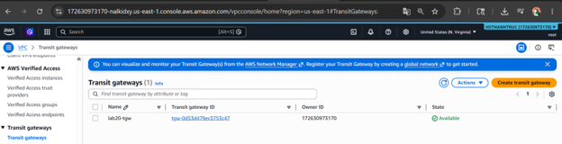
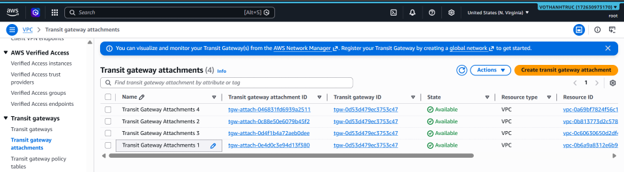
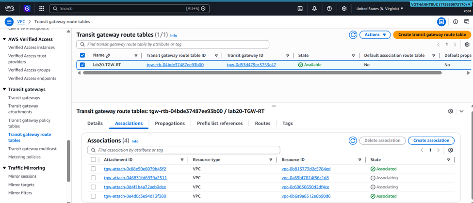
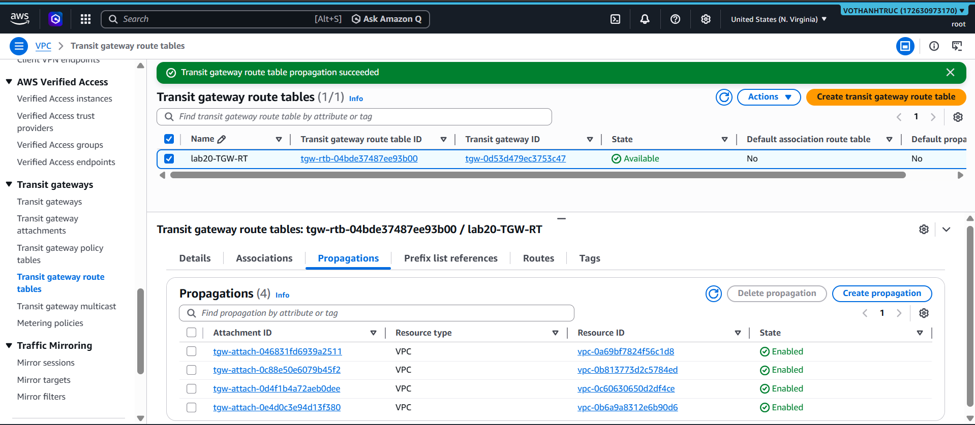
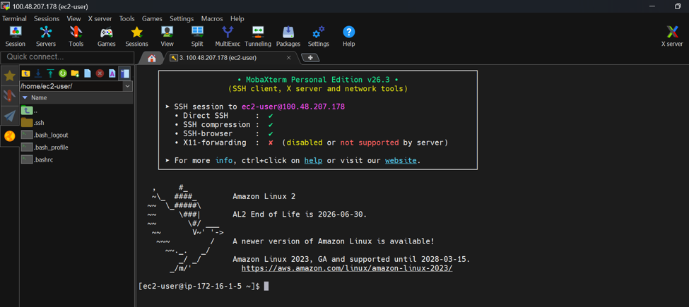
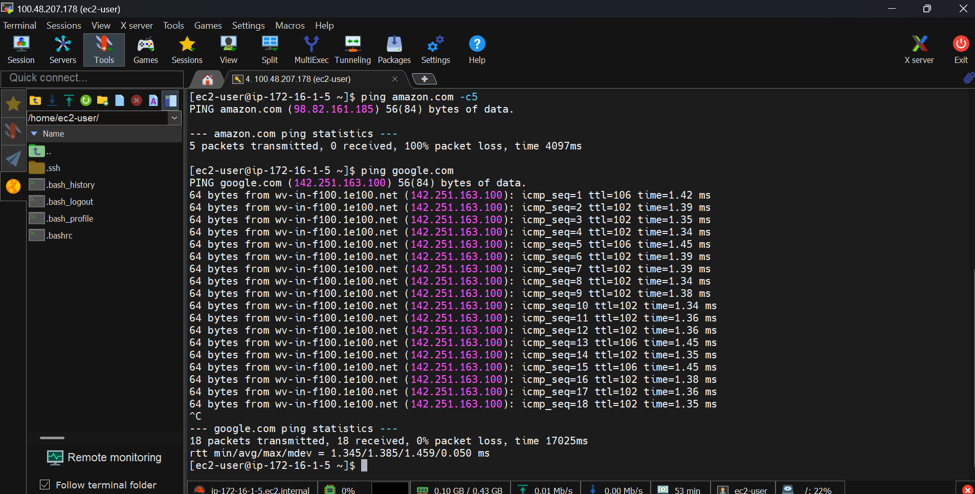

### Mục tiêu tuần 5:

- Xử lý các bài toán nâng cao về quy mô hệ thống mạng đám mây thông qua việc xây dựng bộ định tuyến trung tâm AWS Transit Gateway.
- Nắm vững các đặc tính cốt lõi của máy chủ ảo EC2, bao gồm phân loại Instance, cơ chế lưu trữ, hệ thống tự động co giãn và chia sẻ file mạng.
- Triển khai giải pháp đảm bảo an toàn dữ liệu, tự động hóa sao lưu và khôi phục sau thảm họa (Disaster Recovery) với AWS Backup và Amazon SNS.

### Các công việc cần triển khai trong tuần này:

| Thứ | Công việc                                                                                                                                                                                                       | Ngày bắt đầu | Ngày hoàn thành | Nguồn tài liệu                            |
| --- | --------------------------------------------------------------------------------------------------------------------------------------------------------------------------------------------------------------- | ------------ | --------------- | ----------------------------------------- |
| 2   | - Nghiên cứu sâu lý thuyết Module 03 về EC2: Phân loại chip CPU (Intel, AMD, ARM/Graviton) và cách tối ưu chi phí   - Phân biệt cơ chế lưu trữ giữa EBS Volume và Instance Store (ổ cứng tạm)                | 18/05/2026   | 18/05/2026      | Khóa học First Cloud AI Journey           |
| 3   | - Tìm hiểu tính năng User Data & Metadata của EC2, cơ chế Auto Scaling & Load Balancing   - Nghiên cứu giải pháp lưu trữ mạng chia sẻ (Amazon EFS, FSx) và dịch vụ di trú hệ thống AWS MGN                   | 19/05/2026   | 19/05/2026      | Khóa học First Cloud AI Journey           |
| 4   | - Thực hành Lab 20 (AWS Transit Gateway): Sử dụng CloudFormation khởi tạo nhanh hạ tầng 4 VPC và 4 máy chủ EC2   - Khởi tạo bộ định tuyến trung tâm Transit Gateway để giải quyết bài toán VPC Peering       | 20/05/2026   | 20/05/2026      | Khóa học First Cloud AI Journey           |
| 5   | - Tạo Transit Gateway Attachments để liên kết 4 VPC vào mạng trung tâm   - Cấu hình bảng định tuyến TGW (Associations, Propagations) và cập nhật Route Table của từng VPC trỏ luồng đi qua TGW               | 21/05/2026   | 21/05/2026      | Khóa học First Cloud AI Journey           |
| 6   | - Thực hành Lab 13 (AWS Backup): Xây dựng Backup Plan định nghĩa quy tắc sao lưu và khởi tạo Backup Vault mã hóa KMS   - Cấu hình Amazon SNS tạo Topic gửi cảnh báo sao lưu về Email quản trị                | 22/05/2026   | 22/05/2026      | Khóa học First Cloud AI Journey           |
| 7   | - Kiểm tra mạng qua Reachability Analyzer và SSH thử nghiệm chéo các VPC. Thực hiện Restore Test khôi phục máy chủ EC2   - Thực hiện quy trình dọn dẹp toàn bộ tài nguyên (Backup, SNS, TGW, CloudFormation) | 23/05/2026   | 23/05/2026      | <https://cloudjourney.awsstudygroup.com/> |

### Kết quả đạt được tuần 5:

| Thứ | Công việc                               | Kết quả đạt được                                                                                                                                                                                           |
| --- | --------------------------------------- | ---------------------------------------------------------------------------------------------------------------------------------------------------------------------------------------------------------- |
| 2   | Nghiên cứu kiến trúc máy chủ ảo EC2     | Hiểu rõ chiến lược chọn CPU (đặc biệt là dòng chip Graviton tiết kiệm 40% chi phí). Phân biệt được độ sẵn sàng 99.999% của mạng lưu trữ EBS so với tốc độ đọc ghi của ổ cứng vật lý Instance Store.        |
| 3   | Cơ chế co giãn và lưu trữ mạng          | Nắm vững cách tự động chạy script bằng User Data và gọi thông tin nội bộ qua Metadata. Hiểu được cơ chế chia sẻ file chuẩn NFSv4 (EFS) và SMB chống trùng lặp dữ liệu (FSx).                               |
| 4   | Khởi tạo hạ tầng mạng tập trung Lab 20  | Xây dựng thành công Stack CloudFormation dựng sẵn 4 VPC độc lập. Hiểu rõ ưu điểm của mô hình Hub-and-Spoke (Transit Gateway) so với kết nối dạng lưới (Mesh) của VPC Peering.                              |
| 5   | Cấu hình định tuyến AWS Transit Gateway | Liên kết thành công các mạng ảo vào cổng trung tâm thông qua TGW Attachments, thực hiện tự động hóa truyền bá định tuyến (Propagation) và định tuyến thông suốt từ VPC ra TGW.                             |
| 6   | Triển khai giải pháp AWS Backup tự động | Thiết lập thành công kế hoạch sao lưu hệ thống an toàn vào kho chứa Backup-LAB-VAULT, đồng thời kích hoạt thành công tính năng tự động gửi cảnh báo sự cố qua Email bằng Amazon SNS.                       |
| 7   | Kiểm thử hệ thống và tối ưu tài nguyên  | Xác nhận kết nối mạng riêng (Private) thông suốt giữa VPC 1, VPC 2, VPC 3 và VPC 4. Khôi phục máy chủ thành công từ Recovery Point. Dọn dẹp hoàn toàn mọi tài nguyên thực hành để tránh phát sinh chi phí. |

---

### Hình ảnh minh chứng thực tế bài thực hành:

#### 1. Khởi tạo hạ tầng mạng Lab 20 qua CloudFormation

Hệ thống báo cáo quá trình triển khai ngăn xếp (Stack) Lab20-Stack thành công, tự động tạo ra 4 mạng VPC và các máy chủ EC2 đi kèm để phục vụ cho bài Lab Transit Gateway.

#### 2. Khởi tạo bộ định tuyến trung tâm AWS Transit Gateway

Giao diện hiển thị cổng kết nối trung tâm lab20-tgw đã được khởi tạo thành công và đang ở trạng thái khả dụng (Available).

#### 3. Cấu hình liên kết mạng (Transit Gateway Attachments)

Thực hiện gắn kết thành công cả 4 mạng VPC độc lập vào Transit Gateway, tạo thành mô hình mạng trung tâm Hub-and-Spoke.

#### 4. Cấu hình bảng định tuyến TGW - Tab Associations

Bảng định tuyến của Transit Gateway ghi nhận các VPC đã được liên kết (Associated) thành công, sẵn sàng cho việc nhận định tuyến.

#### 5. Cấu hình bảng định tuyến TGW - Tab Propagations

Kích hoạt thành công tính năng truyền bá định tuyến tự động (Propagation), giúp Transit Gateway tự động nhận diện các dải IP của 4 mạng VPC đã kết nối.

#### 6. Cập nhật Route Table tại các VPC

Định tuyến luồng mạng tại VPC đã được tinh chỉnh, thiết lập hướng đi cho dải IP 172.16.0.0/16 trỏ thẳng vào Transit Gateway thay vì mạng Internet.

#### 7. SSH vào máy chủ Bastion Host (VPC 1)

Sử dụng MobaXterm truy cập thành công vào máy chủ EC2 nằm trong VPC 1 (IP 100.48.207.178) để làm máy nhảy (Bastion Host) chuẩn bị kiểm tra mạng lưới.

#### 8. Kiểm tra kết nối Internet từ máy chủ Bastion

Thực hiện lệnh ping amazon.com và ping google.com thành công từ máy chủ VPC 1 để đảm bảo máy chủ có kết nối mạng ổn định ra bên ngoài trước khi test mạng nội bộ.

#### 9. Thực hiện lệnh ping 172.16.2.5 (VPC 2). Tuy lệnh ping thất bại (100% packet loss) do Security Group chưa cho phép ICMP, nhưng định tuyến mạng đã thông suốt

Từ máy chủ Bastion thuộc VPC 1, thực hiện lệnh ping 172.16.2.5 (VPC 2). Dữ liệu phản hồi thành công chứng minh mạng trung tâm đã định tuyến thông suốt.

#### 10. SSH chéo qua VPC 2 và kiểm tra tiếp đến VPC 3

Sử dụng file khóa (tgw-key.pem) để SSH trực tiếp từ máy nhảy ở VPC 1 sang Private IP của máy chủ ở VPC 2 (172.16.2.5). Ngay sau đó, thực hiện lệnh ping thành công đến dải IP của VPC 3 (172.16.3.7).

#### 11. Hoàn tất kiểm tra định tuyến toàn diện (VPC 4)

Tiếp tục luồng kiểm tra mạng trung tâm Transit Gateway bằng cách ping thành công từ máy chủ hiện tại đến dải IP của VPC 4 (172.16.4.6). Hệ thống mạng của toàn bộ 4 VPC đã liên thông hoàn toàn bảo mật.

