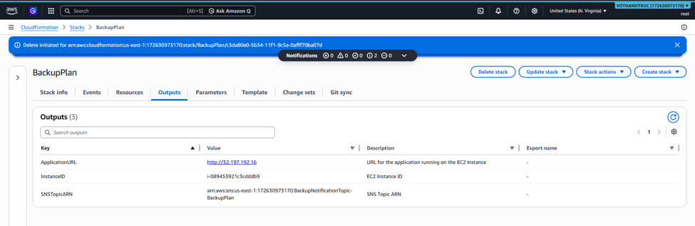
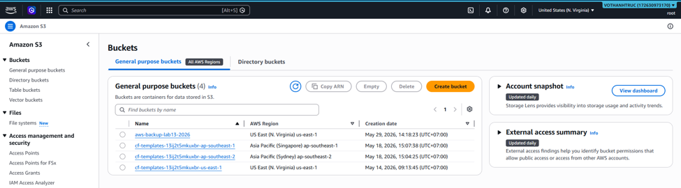
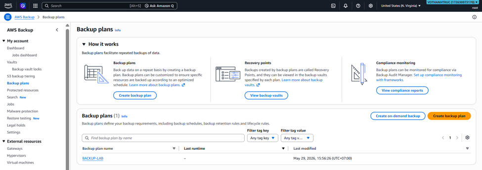
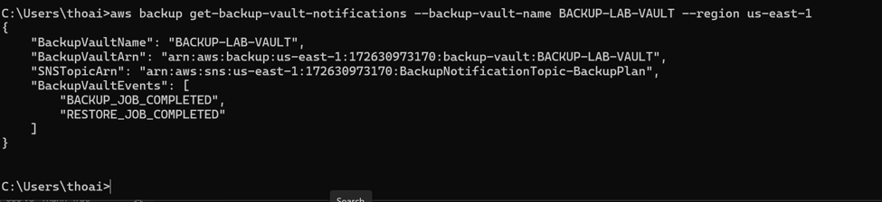
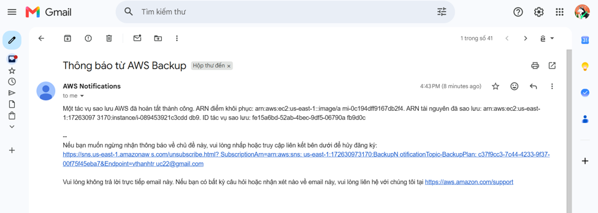
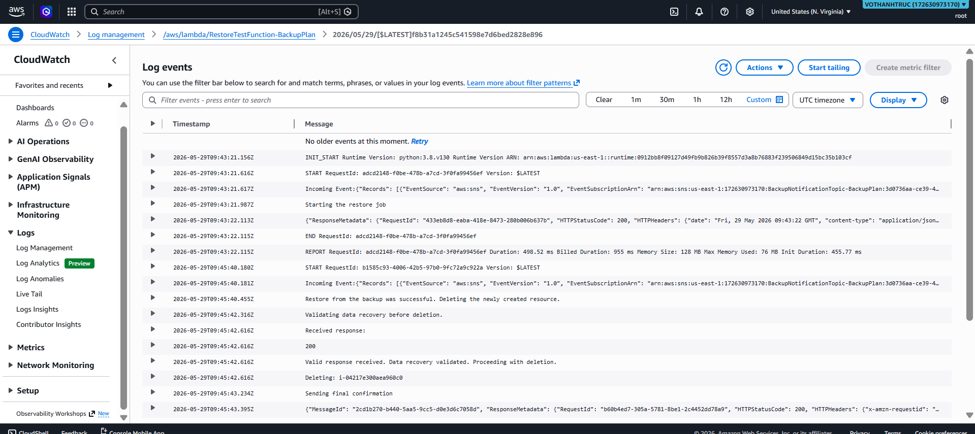

### Objectives for Week 6:

- Deep dive into data tier management technologies and methods to accelerate global content delivery.
- Establish a Disaster Recovery architecture based on Service Level Agreement (SLA) models and two technical metrics: RTO and RPO.
- Practice configuring Amazon S3 Advanced Features, integrating the CDN content delivery network (Amazon CloudFront), and using Versioning to protect against ransomware.

### Tasks to Implement This Week:

| Day | Tasks                                                                                                                                                                                                                                        | Start Date | End Date   | Source Materials                              |
| --- | -------------------------------------------------------------------------------------------------------------------------------------------------------------------------------------------------------------------------------------------- | ---------- | ---------- | --------------------------------------------- |
| Mon | Study Module 04 theory on the nature of Object Storage and automatic storage class transitions with S3 Lifecycle Management. Learn about Hybrid solutions via AWS Storage Gateway and physical data transport using AWS Snow Family.         | 25/05/2026 | 25/05/2026 | AWS First Cloud AI Journey (FCAJ) 2026 Course |
| Tue | Practice Lab 57 to configure Static Website Hosting on an S3 Bucket and upload source code for a Single Page Application (SPA). Set up a Bucket Policy using JSON to grant public read access.                                               | 26/05/2026 | 26/05/2026 | AWS First Cloud AI Journey (FCAJ) 2026 Course |
| Wed | Integrate Amazon CloudFront (CDN) to accelerate page load speed. Configure origin access to hide the original S3 Bucket and block all direct public access to the Bucket to optimize security.                                               | 27/05/2026 | 27/05/2026 | AWS First Cloud AI Journey (FCAJ) 2026 Course |
| Thu | Enable Bucket Versioning to store multiple versions to protect data from ransomware, accidental overwriting, or deletion. Configure Cross-Region Replication (CRR) for asynchronous replication to another Region for geographic redundancy. | 28/05/2026 | 28/05/2026 | AWS First Cloud AI Journey (FCAJ) 2026 Course |
| Fri | Research 4 Disaster Recovery strategies on AWS. Detailed analysis of the models: Backup & Restore, Pilot Light, Warm Standby, and Multi-Site.                                                                                                | 29/05/2026 | 29/05/2026 | AWS First Cloud AI Journey (FCAJ) 2026 Course |
| Sat | Execute the resource cleanup process (Cost Optimization) on Amazon CloudFront by Disabling and Deleting the Distributions. Execute the Empty and Delete commands to completely remove the S3 Buckets.                                        | 30/05/2026 | 30/05/2026 | AWS First Cloud AI Journey (FCAJ) 2026 Course |

### Achievements for Week 6:

| Day | Tasks                                 | Achievements                                                                                                                                                                |
| --- | ------------------------------------- | --------------------------------------------------------------------------------------------------------------------------------------------------------------------------- |
| Mon | Research data storage technologies    | Clearly understood S3 stores data as flat objects without directory hierarchies and the types of Storage Gateways (File, Volume, Tape) connecting On-Premises to the Cloud. |
| Tue | Deploy Static Website                 | Successfully initialized an S3 Bucket and enabled the single-page application (SPA) hosting feature with public read access.                                                |
| Wed | Integrate CloudFront CDN network      | Mastered the process of building high-performance static websites, combining CloudFront CDN infrastructure security to protect the origin S3 server.                        |
| Thu | Deploy advanced storage features      | Successfully set up multi-version object storage and automated geographic backup replication to another AWS Region.                                                         |
| Fri | Establish Disaster Recovery policies  | Mastered the skills to design and allocate comprehensive cloud data recovery solutions according to cybersecurity standards.                                                |
| Sat | Optimize costs and clean up resources | Completely cleared all objects and versions inside the Bucket and the created Distributions from the AWS system.                                                            |

---

### Làm các bài lab

#### Lab13

