### Objectives for Week 8:

- Complete security solutions and optimize resource management for Module 05.
- Deep dive into cloud data architecture in Module 06.
- Practice deploying AWS Security Hub, securing AWS Lambda, and managing resources with Tagging.

### Tasks to Implement This Week:

| Day | Tasks                                                                                                                                                                                                                                                                                                                      | Start Date | End Date   | Source Materials     |
| --- | -------------------------------------------------------------------------------------------------------------------------------------------------------------------------------------------------------------------------------------------------------------------------------------------------------------------------- | ---------- | ---------- | -------------------- |
| Mon | Activate AWS Security Hub to continuously collect data and automatically scan security configurations on the account (Lab 18). Score infrastructure based on security best practices and industry standards to detect vulnerabilities early.                                                                               | 08/06/2026 | 08/06/2026 | AWS FCAJ 2026 Course |
| Tue | Initialize a Security Group with strict Inbound/Outbound rules to control internal VPC network traffic for AWS Lambda (Lab 22). Create a dedicated IAM Execution Role for AWS Lambda, replacing fixed Access Keys. Integrate constraints into the policy, such as allowed timeframes or fixed company IPs.                 | 09/06/2026 | 09/06/2026 | AWS FCAJ 2026 Course |
| Wed | Launch a test EC2 server and apply tagging techniques using Key-Value pairs (Lab 27). Use AWS CLI and Managing Tags to control, interact with, and categorize resource groups. Set up a Tag-based Resource Group system to automatically group related resources.                                                          | 10/06/2026 | 10/06/2026 | AWS FCAJ 2026 Course |
| Thu | Study Core Database Concepts, including Primary Key and Foreign Key structures for data normalization. Apply Indexes to accelerate data reading. Learn about Transaction Log mechanisms for recovery and distinguish between Online Transaction Processing (OLTP) and Online Analytical Processing (OLAP) architectures.   | 11/06/2026 | 11/06/2026 | AWS FCAJ 2026 Course |
| Fri | Learn about Amazon RDS supporting Multi-AZ configurations for synchronous data replication and read replicas. Research Amazon Aurora with parallel read/write performance 3-5 times higher than traditional DBs. Learn about Amazon Redshift (columnar data warehouse) and Amazon ElastiCache (In-memory caching service). | 12/06/2026 | 12/06/2026 | AWS FCAJ 2026 Course |
| Sat | Access AWS Security Hub to Disable evaluation standards and deactivate the service (Lab 18). Delete the IAM Role assigned to Lambda, delete the corresponding Lambda function, and remove the Security Group (Lab 22). Delete the Resource Group configuration and Terminate all test EC2 instances (Lab 27).              | 13/06/2026 | 13/06/2026 | AWS FCAJ 2026 Course |

### Achievements for Week 8:

| Day      | Tasks                            | Achievements                                                                                                                                                                                      |
| -------- | -------------------------------- | ------------------------------------------------------------------------------------------------------------------------------------------------------------------------------------------------- |
| Mon      | Evaluate security configurations | Successfully operated the automated security auditing tool, Security Hub.                                                                                                                         |
| Tue      | Serverless Computing Security    | Successfully established network security permissions for AWS Lambda using Security Groups and IAM Roles.                                                                                         |
| Wed      | Tag-based Resource Management    | Optimized large-scale infrastructure management through Resource Groups.                                                                                                                          |
| Thu, Fri | Cloud Database Research          | Mastered data architecture allocation: Using SQL (RDS/Aurora) for daily transactional tasks (OLTP), Redshift for analytical data warehouses (OLAP), and ElastiCache to accelerate response times. |
| Sat      | Cost Optimization and Cleanup    | Completed stopping the Security Hub scanning process, successfully removed the IAM Role/Lambda, deleted the Resource Group configuration, and freed up EBS storage memory.                        |

---

### Làm các bài lab:

- Tiếp tục thực hiện các bài lab của Module.

#### Lab18

#### Lab22

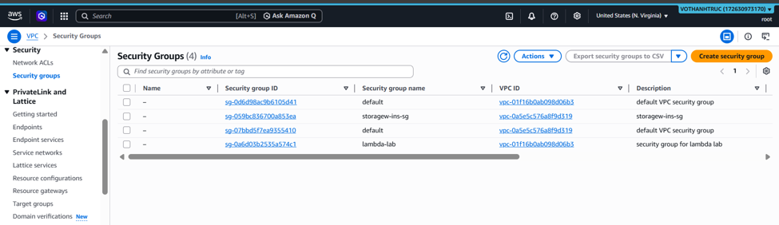
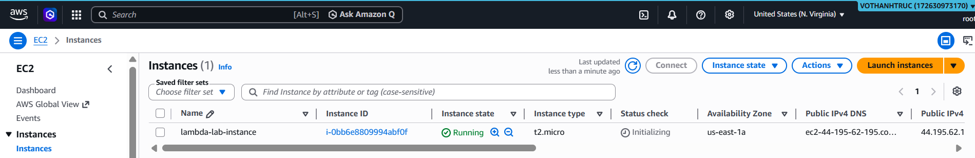
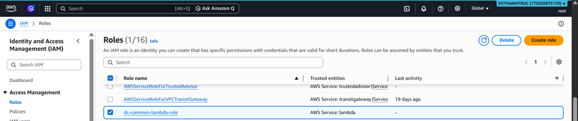

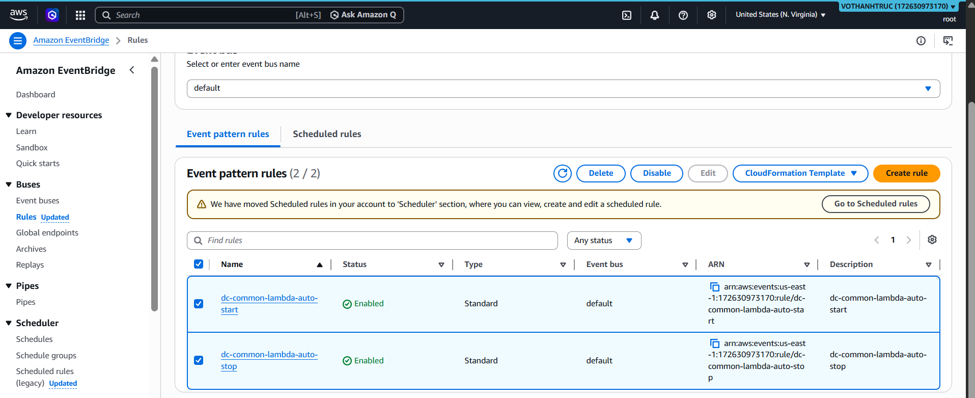
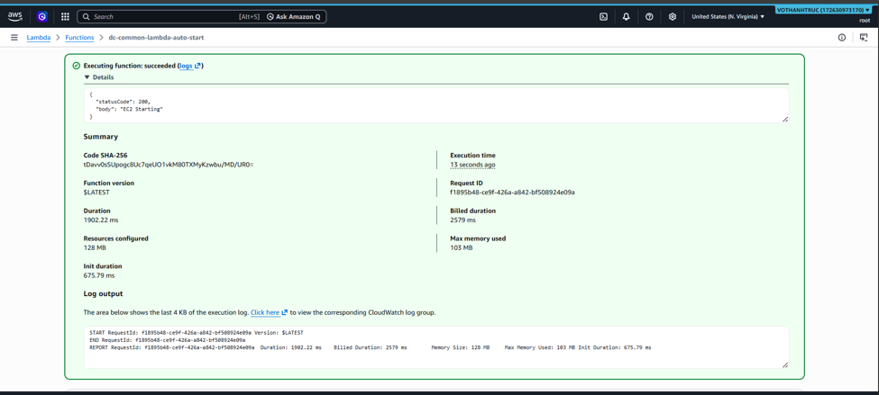

#### Lab27

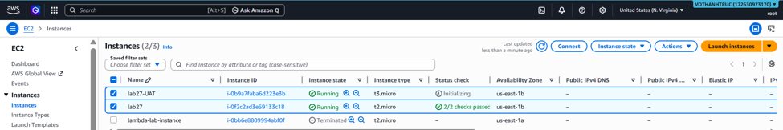

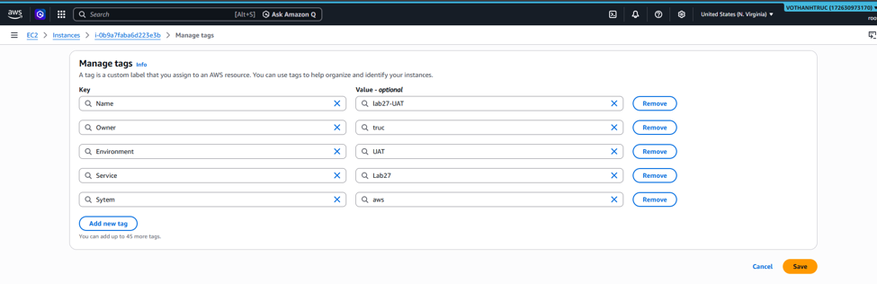

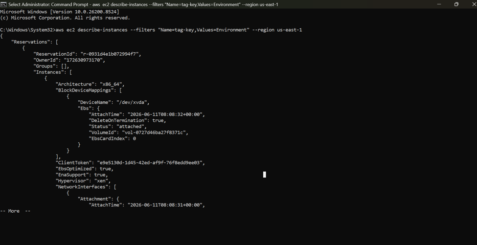
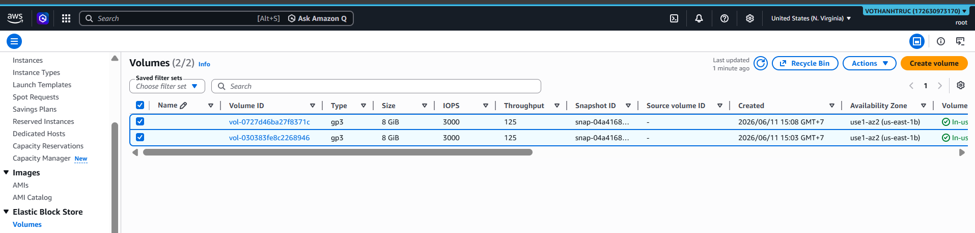
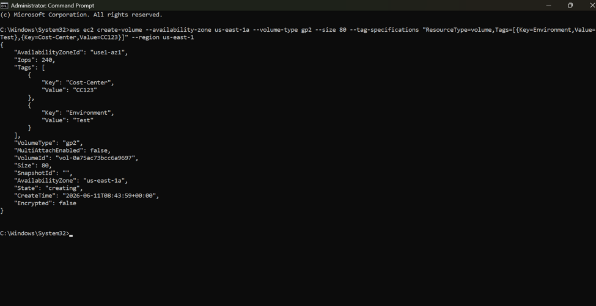

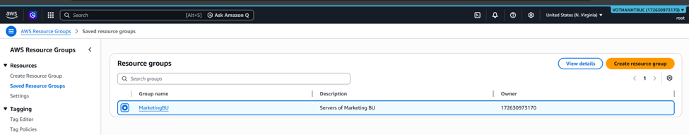
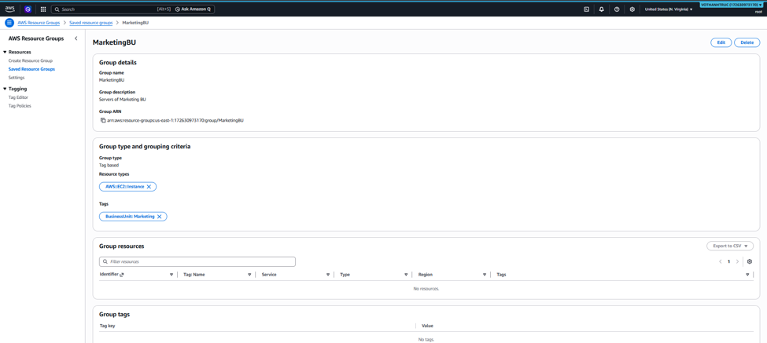

#### Lab28

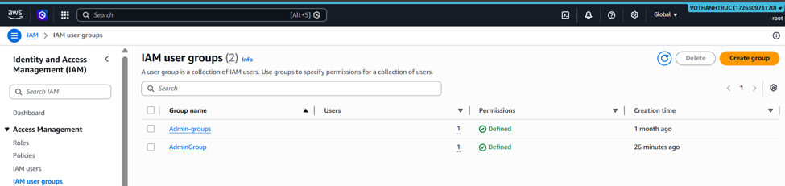
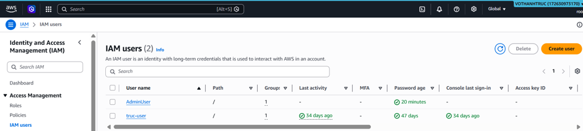
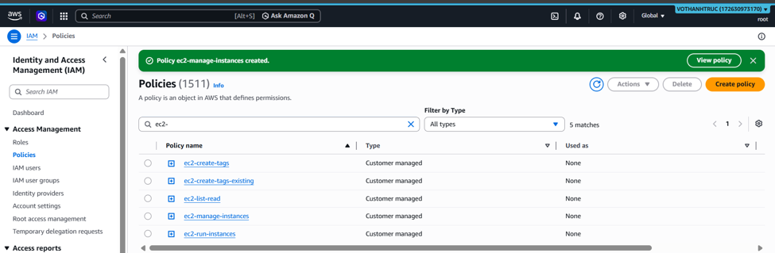

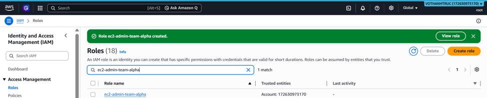
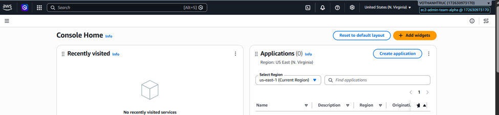

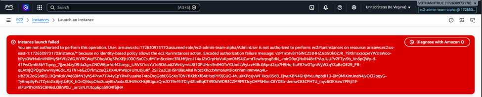
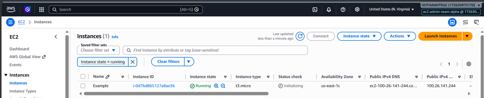
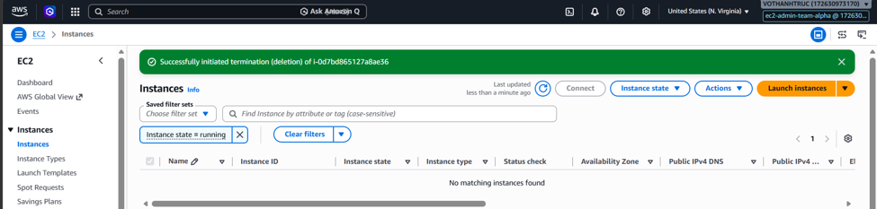

#### Lab30

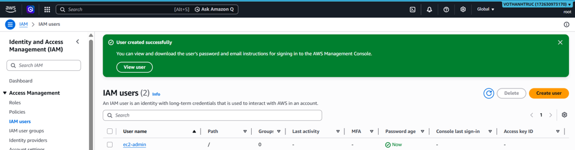

