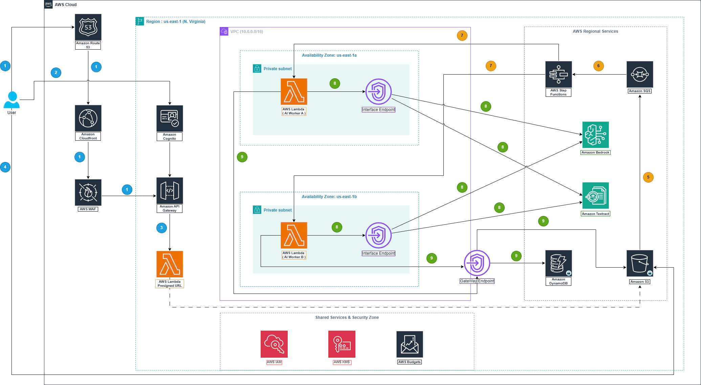

### Mục tiêu tuần 9:

- Khảo sát và lựa chọn chủ đề phù hợp để xây dựng dự án thực tế trên nền tảng AWS.
- Nghiên cứu phương pháp và công cụ chuyên dụng để vẽ sơ đồ kiến trúc hệ thống đám mây (AWS Architecture Icons, draw.io, Lucidchart).
- Phác thảo bản nháp đầu tiên cho sơ đồ kiến trúc dự án và mang đi tham khảo ý kiến từ các anh chị Admin trong group First Cloud Journey.

### Các công việc cần triển khai trong tuần này:

| Thứ | Công việc                                                                                                                                                                                                                        | Ngày bắt đầu | Ngày hoàn thành | Nguồn tài liệu                            |
| --- | -------------------------------------------------------------------------------------------------------------------------------------------------------------------------------------------------------------------------------- | ------------ | --------------- | ----------------------------------------- |
| 2   | - Tổng hợp các ý tưởng dự án tiềm năng, phân tích yêu cầu và phạm vi từng ý tưởng   - Tham khảo các bài workshop mẫu trên AWS Study Group để lấy cảm hứng về chủ đề và cấu trúc dự án                                         | 15/06/2026   | 15/06/2026      | <https://cloudjourney.awsstudygroup.com/> |
| 3   | - Chốt chủ đề dự án chính thức, viết bản mô tả tổng quan dự án (Project Brief) bao gồm mục tiêu, phạm vi và các thành phần chính   - Liệt kê các dịch vụ AWS cần sử dụng trong dự án                                          | 16/06/2026   | 16/06/2026      | Khóa học First Cloud AI Journey           |
| 4   | - Nghiên cứu bộ biểu tượng kiến trúc AWS Architecture Icons chính thức và quy tắc trình bày sơ đồ theo chuẩn AWS   - Tìm hiểu cách sử dụng công cụ draw.io / Lucidchart với bộ AWS Icon Set                                   | 17/06/2026   | 17/06/2026      | AWS Architecture Icons, draw.io           |
| 5   | - Thực hành vẽ thử một sơ đồ kiến trúc mẫu đơn giản (VPC + EC2 + RDS) để làm quen thao tác   - Phác thảo sơ đồ kiến trúc bản nháp phiên bản v1 cho dự án đã chọn                                                              | 18/06/2026   | 18/06/2026      | draw.io, AWS Well-Architected Framework   |
| 6   | - Hoàn thiện sơ đồ kiến trúc v1, xác định các luồng dữ liệu, kết nối mạng và phân vùng bảo mật   - Mang sơ đồ kiến trúc đã phác thảo đi trao đổi và xin ý kiến tham khảo từ các anh chị Admin trong group First Cloud Journey | 19/06/2026   | 19/06/2026      | Anh chị Admin FCJ, draw.io                |
| 7   | - Đánh giá các góp ý từ anh chị Admin, ghi chú các điểm cần cải thiện và bổ sung vào sơ đồ   - Tổng hợp tài liệu tham khảo và chuẩn bị nội dung cho tuần tiếp theo                                                            | 20/06/2026   | 20/06/2026      | <https://cloudjourney.awsstudygroup.com/> |

### Kết quả đạt được tuần 9:

| Thứ | Công việc                                          | Kết quả đạt được                                                                                                                                                                                |
| --- | -------------------------------------------------- | ----------------------------------------------------------------------------------------------------------------------------------------------------------------------------------------------- |
| 2   | Khảo sát ý tưởng và tham khảo workshop mẫu         | Tổng hợp được danh sách các ý tưởng dự án tiềm năng, phân tích ưu nhược điểm từng phương án dựa trên kiến thức AWS đã học từ tuần 1-8 và các workshop mẫu trên AWS Study Group.                 |
| 3   | Chốt đề tài và viết Project Brief                  | Chốt được chủ đề dự án chính thức, hoàn thành bản mô tả tổng quan dự án với mục tiêu, phạm vi và thành phần rõ ràng cùng danh sách dịch vụ AWS cần triển khai.                                  |
| 4   | Nghiên cứu Architecture Icons và công cụ vẽ        | Nắm vững bộ biểu tượng AWS Architecture Icons, quy tắc vẽ sơ đồ chuẩn. Sử dụng thành thạo draw.io / Lucidchart với bộ AWS Icon Set.                                                             |
| 5   | Thực hành vẽ mẫu và phác thảo kiến trúc v1         | Vẽ được sơ đồ kiến trúc mẫu đơn giản để làm quen, sau đó phác thảo thành công bản nháp sơ đồ kiến trúc phiên bản v1 cho dự án đã chọn.                                                          |
| 6   | Hoàn thiện sơ đồ v1 và tham khảo anh chị Admin FCJ | Hoàn thiện sơ đồ kiến trúc v1 với đầy đủ luồng dữ liệu và phân vùng bảo mật. Mang sơ đồ đi trao đổi với anh chị Admin trong group và nhận được các góp ý quý giá về hướng đi kiến trúc.         |
| 7   | Đánh giá góp ý và chuẩn bị tài liệu                | Tổng hợp các nhận xét từ anh chị Admin, ghi nhận các điểm cần cải thiện về hiệu năng, bảo mật và chi phí. Chuẩn bị đầy đủ tài liệu kỹ thuật cho giai đoạn thiết kế chính thức ở tuần tiếp theo. |

---

### Hình ảnh minh chứng thực tế:

## Đây là hình ảnh sơ đồ kiến trúc của nhóm khi chưa nghe anh chị admin đánh giá và nhận xét, bị sai và cần chính sửa lại

