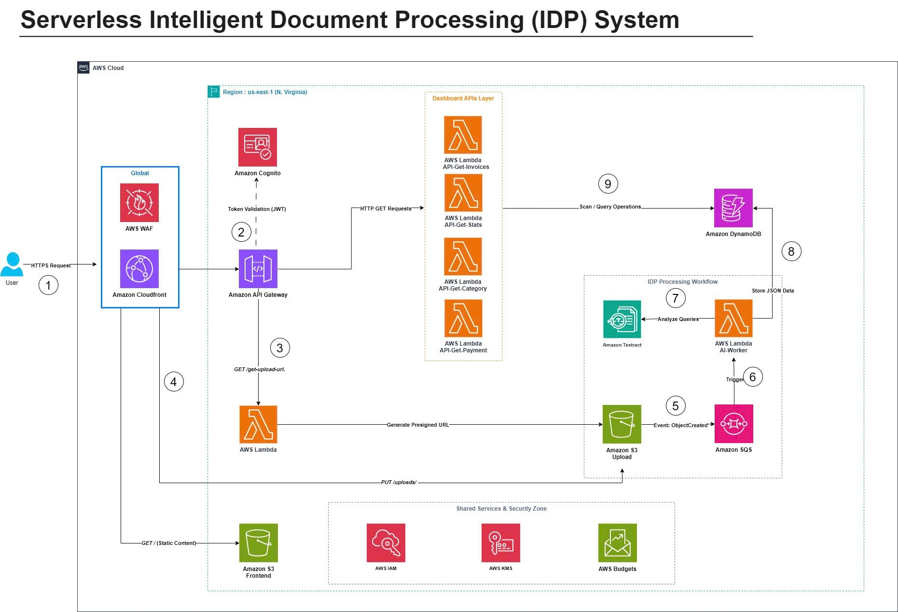

Tại phần này, nhóm trình bày ý tưởng và kế hoạch triển khai dự án sẽ thực hiện trong chương trình **AWS First Cloud AI Journey 2026**.

# Serverless Intelligent Document Processing (IDP) System

## Giải pháp xử lý tài liệu thông minh trên nền tảng AWS Serverless

---

## 1. Tóm tắt điều hành

Serverless Intelligent Document Processing (IDP) System là hệ thống giúp người dùng tải lên các loại tài liệu như hóa đơn VAT, chứng từ thanh toán hoặc giấy tờ hành chính thông qua giao diện Web. Sau khi tài liệu được tải lên, hệ thống sẽ tự động sử dụng dịch vụ AI của AWS để nhận diện, bóc tách các thông tin quan trọng và lưu trữ dưới dạng dữ liệu có cấu trúc nhằm phục vụ tìm kiếm, thống kê và quản lý.

Toàn bộ hệ thống được xây dựng theo kiến trúc **Serverless**, không sử dụng máy chủ EC2, giúp giảm chi phí vận hành, tự động mở rộng theo tải và đơn giản hóa việc quản trị hạ tầng.

---

## 2. Tuyên bố vấn đề

### Vấn đề hiện tại

Trong nhiều doanh nghiệp, việc nhập dữ liệu từ hóa đơn hoặc chứng từ vẫn được thực hiện thủ công. Quá trình này tốn nhiều thời gian, dễ xảy ra sai sót và gây khó khăn khi cần thống kê hoặc tìm kiếm dữ liệu.

Ngoài ra, việc xây dựng hệ thống OCR truyền thống thường yêu cầu triển khai máy chủ, cài đặt phần mềm nhận dạng văn bản và quản lý hạ tầng, làm tăng chi phí đầu tư cũng như công sức bảo trì.

### Giải pháp

Nhóm đề xuất xây dựng hệ thống xử lý tài liệu thông minh sử dụng hoàn toàn các dịch vụ AWS Serverless.

Người dùng tải tài liệu lên thông qua giao diện Web. Hệ thống sử dụng **S3 Presigned URL** để upload trực tiếp vào Amazon S3, sau đó kích hoạt quy trình xử lý bất đồng bộ thông qua Amazon SQS và AWS Lambda. Lambda sẽ gọi Amazon Textract để trích xuất dữ liệu từ tài liệu và lưu kết quả vào Amazon DynamoDB.

Frontend sẽ gọi các API được triển khai trên Amazon API Gateway để hiển thị lịch sử hóa đơn, thống kê doanh thu và các biểu đồ phân tích.

### Lợi ích và Ro

Giải pháp mang lại nhiều lợi ích:

- Tự động hóa hoàn toàn quy trình nhập liệu.
- Giảm thời gian xử lý tài liệu.
- Tăng độ chính xác nhờ AI.
- Không cần quản lý máy chủ.
- Chi phí vận hành thấp nhờ chỉ trả phí theo mức sử dụng.
- Dễ dàng mở rộng khi số lượng tài liệu tăng.

---

## 3. Kiến trúc giải pháp

Hệ thống được xây dựng theo mô hình Event-Driven Serverless Architecture.

Frontend React được lưu trữ trên Amazon S3. AWS WAF được tích hợp để bảo vệ ứng dụng trước các truy cập độc hại.

Người dùng đăng nhập thông qua Amazon Cognito. Sau khi xác thực thành công, API Gateway sẽ kiểm tra JWT Token trước khi chuyển yêu cầu đến các hàm AWS Lambda.

Đối với chức năng upload tài liệu, Lambda tạo Presigned URL để người dùng tải trực tiếp tài liệu lên Amazon S3. Khi có file mới, Amazon S3 phát sinh sự kiện ObjectCreated gửi vào Amazon SQS. Lambda AI Worker sẽ lấy từng tài liệu trong hàng đợi, gửi đến Amazon Textract để phân tích nội dung, sau đó lưu kết quả vào Amazon DynamoDB.

Các API Dashboard sẽ đọc dữ liệu từ DynamoDB để hiển thị danh sách hóa đơn, thống kê doanh thu và các biểu đồ trực quan.

### Dịch vụ AWS sử dụng

- AWS WAF
- Amazon S3
- Amazon API Gateway
- Amazon Cognito
- AWS Lambda
- Amazon SQS
- Amazon Textract
- Amazon DynamoDB
- AWS IAM
- AWS KMS
- AWS Budgets

### Thiết kế thành phần

**Frontend**

- React Single Page Application
- Amazon S3

**Authentication**

- Amazon Cognito User Pool
- JWT Authentication

**Backend API**

- Amazon API Gateway
- AWS Lambda

**Upload Service**

- Amazon S3
- Presigned URL

**AI Processing**

- Amazon SQS
- AWS Lambda Worker
- Amazon Textract

**Database**

- Amazon DynamoDB

**Security**

- AWS WAF
- IAM
- KMS

**Monitoring**

- AWS Budgets

---

## 4. Triển khai kỹ thuật

### Các giai đoạn triển khai

Dự án được chia thành bốn giai đoạn chính.

**Giai đoạn 1**

- Khảo sát yêu cầu
- Thiết kế kiến trúc AWS
- Phân tích luồng xử lý dữ liệu

**Giai đoạn 2**

- Xây dựng Frontend
- Triển khai Cognito
- Xây dựng REST API bằng API Gateway và Lambda

**Giai đoạn 3**

- Triển khai quy trình upload
- Xử lý tài liệu bằng Textract
- Lưu dữ liệu vào DynamoDB

**Giai đoạn 4**

- Xây dựng Dashboard
- Kiểm thử
- Tối ưu chi phí
- Hoàn thiện hệ thống

### Yêu cầu kỹ thuật

Kiến thức cần sử dụng:

- AWS Lambda
- Amazon S3
- Amazon API Gateway
- Amazon Cognito
- Amazon Textract
- Amazon DynamoDB
- Amazon SQS
- AWS IAM
- AWS WAF
- ReactJS
- JavaScript
- AWS SDK

---

## 5. Lộ trình & Mốc triển khai

- _Trước thực tập (Tháng 0)_: 1 tháng lên kế hoạch và đánh giá trạm cũ.
- _Thực tập (Tháng 1–3)_:
  - Tháng 1: Học AWS và nâng cấp phần cứng.
  - Tháng 2: Thiết kế và điều chỉnh kiến trúc.
  - Tháng 3: Triển khai, kiểm thử, đưa vào sử dụng.
- _Sau triển khai_: Nghiên cứu thêm trong vòng 1 năm.

---

## 6. Ước tính ngân sách

Nhằm đảm bảo hệ thống có thể triển khai trong phạm vi ngân sách của sinh viên nhưng vẫn đáp ứng đầy đủ các yêu cầu về hiệu năng, khả năng mở rộng và tính sẵn sàng, nhóm đã tiến hành ước tính chi phí dựa trên AWS Pricing Calculator.

Kiến trúc của hệ thống sử dụng hoàn toàn các dịch vụ Serverless, do đó chi phí chỉ phát sinh khi có người sử dụng hoặc khi tài liệu được xử lý. Điều này giúp giảm đáng kể chi phí vận hành so với mô hình sử dụng máy chủ EC2 chạy liên tục.

Có thể xem chi phí trên AWS Pricing Calculator sau khi hoàn thiện kiến trúc triển khai.

Chi phí hạ tầng ước tính

| AWS Service        | Mục đích sử dụng                         | Chi phí/tháng (Ước tính) |
| ------------------ | ---------------------------------------- | ------------------------ |
| Amazon S3          | Lưu trữ giao diện Web và tài liệu Upload | 1.20 USD                 |
| AWS WAF            | Bảo vệ ứng dụng Web                      | 2.50 USD                 |
| Amazon API Gateway | REST API                                 | 0.80 USD                 |
| AWS Lambda         | Xử lý Backend và AI Workflow             | 1.00 USD                 |
| Amazon Cognito     | Đăng nhập người dùng                     | 0.00 USD _(Free Tier)_   |
| Amazon Textract    | OCR và AI Document Processing            | 4.50 USD                 |
| Amazon DynamoDB    | Lưu dữ liệu hóa đơn                      | 0.60 USD                 |
| Amazon SQS         | Event Queue                              | 0.10 USD                 |
| AWS KMS            | Mã hóa dữ liệu                           | 0.15 USD                 |
| AWS Budgets        | Theo dõi chi phí                         | 0.00 USD                 |

Tổng chi phí

| Hạng mục               | Chi phí                 |
| ---------------------- | ----------------------- |
| Tổng chi phí hạ tầng   | **≈ 12.35 USD / tháng** |
| Chi phí trong 12 tháng | **≈ 148 USD / năm**     |

Do hệ thống sử dụng mô hình Serverless nên hầu hết dịch vụ đều áp dụng cơ chế **Pay-as-you-go**, phù hợp với các dự án nghiên cứu và quy mô nhỏ.

---

## 7. Đánh giá rủi ro

### Ma trận rủi ro

- Textract nhận diện sai dữ liệu.
- Upload thất bại khi mất kết nối Internet.
- Chi phí Textract tăng khi số lượng tài liệu lớn.
- Lambda Timeout khi xử lý tài liệu quá lớn.

### Chiến lược giảm thiểu

- Kiểm tra dữ liệu đầu ra trước khi lưu.
- Sử dụng Amazon SQS để xử lý bất đồng bộ.
- Thiết lập AWS Budgets để theo dõi chi phí.
- Giới hạn dung lượng file upload.

### Kế hoạch dự phòng

- Cho phép người dùng tải lại tài liệu.
- Retry tự động thông qua SQS.
- Theo dõi lỗi bằng CloudWatch Logs.
- Mã hóa dữ liệu bằng AWS KMS.

---

## 8. Kết quả kỳ vọng

### Cải tiến kỹ thuật

- Tự động hóa quy trình xử lý tài liệu.
- Rút ngắn thời gian nhập liệu.
- Tăng độ chính xác nhờ Amazon Textract.
- Kiến trúc Serverless có khả năng mở rộng linh hoạt.

### Giá trị dài hạn

Hệ thống có thể mở rộng để xử lý nhiều loại tài liệu khác nhau như hóa đơn điện tử, giấy phép kinh doanh, căn cước công dân hoặc hợp đồng. Đồng thời, đây cũng là nền tảng để tích hợp thêm các dịch vụ AI của AWS trong tương lai như Amazon Comprehend hoặc Amazon Bedrock nhằm nâng cao khả năng phân tích tài liệu.
