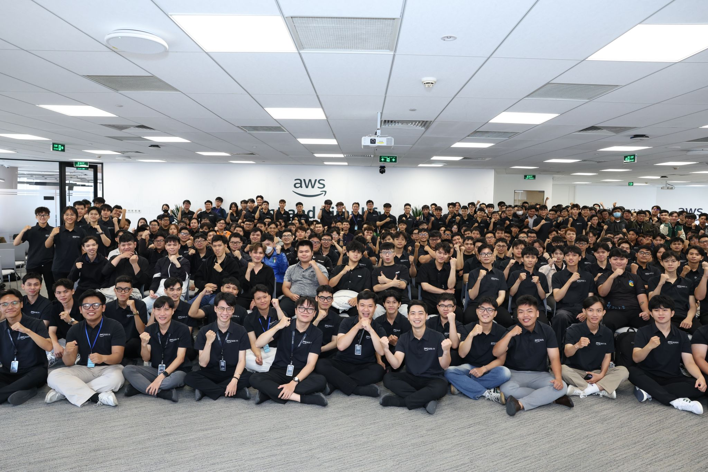
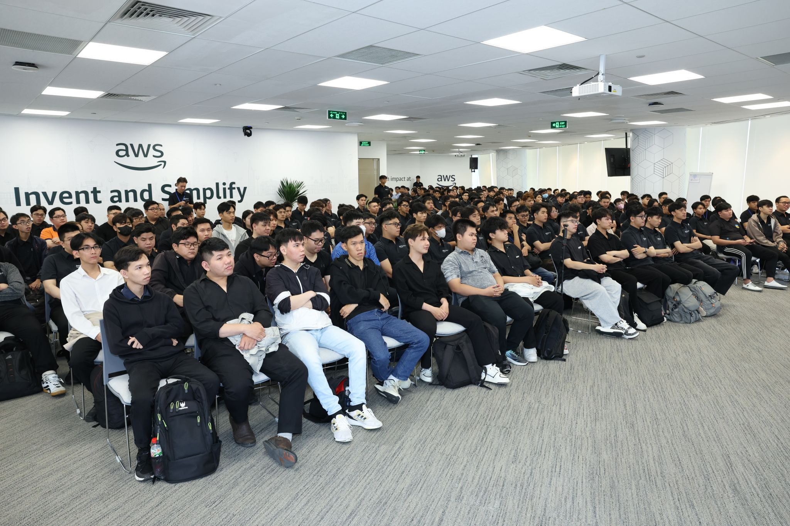

# Bài thu hoạch Sự kiện

### Mục Đích Của Sự Kiện

- Hướng dẫn phương pháp quản lý tâm lý và não bộ (dopamine) để tối ưu hóa việc học tập.
- Chia sẻ kỹ thuật Prompt Engineering chuyên sâu và cách giao tiếp hiệu quả với AI.
- Định hướng tư duy (mindset) nghề nghiệp cốt lõi cho sinh viên công nghệ thông tin chuẩn bị đi làm.
- Giới thiệu phương pháp ứng dụng AI Agent vào quy trình phát triển phần mềm thực tế.

### Danh Sách Diễn Giả

- **Anh Huỳnh Hoàng Long**
- **Anh Nguyễn Thịnh**
- **Anh Khang**
- **Chị Thảo**

### Nội Dung Nổi Bật

#### 1. Quản lý Dopamine để hack não và nghiện học (Diễn giả Huỳnh Hoàng Long)

- **Nội dung chính:** Hướng dẫn cách biến việc học trở nên hấp dẫn như việc chơi game hay lướt mạng xã hội bằng cách đánh lừa não bộ.
- **Cơ chế hoạt động:** Não bộ tiết ra dopamine (chất kích thích sự hưng phấn) không phải khi nhận được phần thưởng, mà là khi mong đợi phần thưởng sắp đến.
- **Phương pháp thực hành:**
  - Tự tạo ra các hệ thống phần thưởng ngẫu nhiên sau mỗi phiên học ngắn để kích thích sự tò mò.
  - Duy trì chuỗi học tập (đánh dấu lịch) để tận dụng tâm lý sợ mất chuỗi của con người, tương tự như cách các ứng dụng game hay mạng xã hội giữ chân người dùng.
  - Chia nhỏ khối lượng kiến thức khổng lồ để não không bị ngợp (đánh lừa hạch hạnh nhân) và áp dụng quy tắc 2 phút (việc gì làm được trong 2 phút thì làm ngay).

#### 2. Nghệ thuật Prompt Engineering (Diễn giả Nguyễn Thịnh)

- **Nội dung chính:** Bài chia sẻ được trình bày bằng tiếng Anh, tập trung vào cách giao tiếp hiệu quả với AI (LLMs) để nhận được kết quả tốt nhất, tránh tình trạng AI bị ảo giác (hallucination) hoặc trả về kết quả chung chung.
- **Phương pháp viết Prompt:** Một câu lệnh tốt cần hội tụ 7 yếu tố:
  1. Xác định vai trò (Role)
  2. Hướng dẫn (Instruction)
  3. Ngữ cảnh (Context)
  4. Định dạng đầu vào/đầu ra (Input/Output format)
  5. Ví dụ (Example)
  6. Ràng buộc (Constraint)
- **Kỹ thuật nâng cao:** Sử dụng các kỹ thuật suy luận sâu của AI như Chain of Thought hay Tree of Thought.
- **Demo thực tế:** Giới thiệu dự án cá nhân xây dựng trên nền tảng AWS (kết hợp S3, CloudFront, Cognito, API Gateway, Lambda, Bedrock và DynamoDB) nhằm tạo ra một tiện ích mở rộng giúp tối ưu hóa Prompt trực tiếp trên trình duyệt.

#### 3. Định hướng tư duy (Mindset) đi làm cho sinh viên IT (Diễn giả Anh Khang)

- **Nội dung chính:** Tập trung vào tư duy nghề nghiệp cho sinh viên năm 3, năm 4 thay vì các vấn đề kỹ thuật khô khan. Khẳng định rằng AI không thay thế công việc, nó chỉ là công cụ khuếch đại (amplify) năng lực làm người giỏi trở nên giỏi hơn.
- **Tầm quan trọng của nền tảng:** Doanh nghiệp không yêu cầu sinh viên phải biết mọi framework, mà cần những người có kiến thức nền tảng (foundation) thật vững chắc và tư duy giải quyết vấn đề đúng đắn.
- **Tư duy cốt lõi:**
  - Luôn đặt câu hỏi Tại sao (Why): Phải hiểu giá trị cốt lõi và lý do chọn công nghệ đó thay vì chỉ làm cho xong (What).
  - Đề cao sự liêm chính (Integrity): Cần có sự chính trực trong công việc, chủ động kiểm tra các trường hợp ngoại lệ trong code kể cả khi không được yêu cầu. Xây dựng tư duy dài hạn, dũng cảm đối mặt với sai lầm và liên tục học hỏi từ cộng đồng.

#### 4. Phương pháp BMX dùng AI Agent trong phát triển phần mềm (Diễn giả Chị Thảo)

- **Nội dung chính:** Chị Thảo (Software Developer tại VIB) giới thiệu phương pháp BMX nhằm giải quyết thực trạng AI sinh ra code rác hoặc mất ngữ cảnh khi lập trình viên bắt AI viết toàn bộ dự án từ một câu lệnh quá lớn.
- **Cách thức hoạt động:** Phương pháp này chia quy trình phát triển thành nhiều vai trò khác nhau, tương ứng với các AI Agent độc lập (PM, Architect, Scrum Master, Developer, Tester).
- **Quy trình triển khai:**
  - Bắt đầu bằng việc brainstorm ý tưởng với AI để xuất ra tài liệu yêu cầu (PRD).
  - Phân tích kiến trúc hệ thống, sau đó chia nhỏ dự án thành các Epic và Story.
  - Mỗi AI Agent sẽ chỉ đảm nhận việc viết code hoặc test cho từng phần nhỏ, tự động lặp lại quy trình sửa lỗi cho đến khi dự án hoàn thiện mà không bị nhầm lẫn ngữ cảnh.

### Những Gì Học Được

#### Phát triển bản thân

- Biết cách làm chủ cảm xúc và lợi dụng cơ chế tiết dopamine của não bộ để duy trì động lực, biến việc học thành thói quen hấp dẫn.
- Định hình được tư duy dài hạn, sự liêm chính trong lập trình và hiểu được tầm quan trọng của việc xây dựng nền tảng vững chắc trước khi chạy theo các framework mới.

#### Nâng cao kỹ năng chuyên môn

- Nắm vững công thức 7 yếu tố để thiết kế cấu trúc Prompt chuyên nghiệp, giúp giao tiếp chính xác với các mô hình ngôn ngữ lớn (LLMs).
- Nắm được phương pháp luận BMX và cách phân rã hệ thống thành các AI Agent để ứng dụng AI vào quá trình code một cách an toàn, hiệu quả mà không bị rác code.

### Trải nghiệm trong event

Tham gia sự kiện mang lại cho tôi những trải nghiệm vô cùng quý giá, giúp kết nối hài hòa giữa kỹ năng quản trị bản thân, tư duy nghề nghiệp và cập nhật công nghệ mới nhất. Một số trải nghiệm nổi bật:

- **Học hỏi đa chiều:** Được tiếp cận kiến thức từ nhiều góc nhìn khác nhau, từ cách quản lý bộ não của bản thân (Anh Long), tư duy lập nghiệp (Anh Khang) cho đến các kỹ thuật thực chiến như viết Prompt (Anh Thịnh) và dùng AI Agent (Chị Thảo).
- **Trải nghiệm thực tế:** Buổi demo tiện ích mở rộng trên nền tảng AWS bằng tiếng Anh của diễn giả Nguyễn Thịnh rất ấn tượng, cho thấy khả năng ứng dụng mạnh mẽ của Cloud và AI vào thực tế.
- **Thay đổi nhận thức:** Giúp tôi giải tỏa được áp lực và nỗi lo sợ bị AI thay thế, thay vào đó hiểu cách dùng AI như một đòn bẩy khuếch đại năng lực, từ đó tự tin hơn trong định hướng nghề nghiệp sắp tới.

#### Hình ảnh minh chứng

